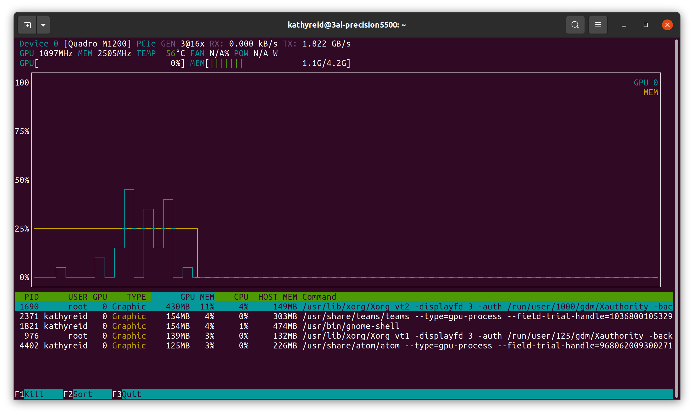

# Setting up your environment for training using DeepSpeech

This section of the Playbook assumes you are comfortable installing DeepSpeech and using it with a pre-trained model, and that you are comfortable setting up a Python _virtual environment_. Here, we provide information on setting up a Docker environment for training your own speech recognition model using DeepSpeech. We also cover dependencies Docker has for NVIDIA GPUs, so that you can use your GPU(s) for training a model.

You _can_ use CPU(s) only for training, but this will be _much_ slower.

## Installing dependencies for working with GPUs under Docker

Before we install Docker, we are going to make sure that we have all the Ubuntu Linux dependencies required for working with NVIDIA GPUs and Docker.

---
@todo what if someone has a non-NVIDIA GPU? Personally I think they're so rare that we should just assume NVIDIA GPUs.
---

### GPU drivers

By default, your machine should already have GPU drivers installed. A good way to check is with the `nvidia-smi` tool. If your drivers are installed correctly, `nvidia-smi` will report the driver version and CUDA version.

```
$ nvidia-smi

Sat Jan  9 11:48:50 2021       
+-----------------------------------------------------------------------------+
| NVIDIA-SMI 450.80.02    Driver Version: 450.80.02    CUDA Version: 11.0     |
|-------------------------------+----------------------+----------------------+
| GPU  Name        Persistence-M| Bus-Id        Disp.A | Volatile Uncorr. ECC |
| Fan  Temp  Perf  Pwr:Usage/Cap|         Memory-Usage | GPU-Util  Compute M. |
|                               |                      |               MIG M. |
|===============================+======================+======================|
|   0  GeForce GTX 1060    Off  | 00000000:01:00.0  On |                  N/A |
| N/A   70C    P0    27W /  N/A |    766MiB /  6069MiB |      2%      Default |
|                               |                      |                  N/A |
+-------------------------------+----------------------+----------------------+

+-----------------------------------------------------------------------------+
| Processes:                                                                  |
|  GPU   GI   CI        PID   Type   Process name                  GPU Memory |
|        ID   ID                                                   Usage      |
|=============================================================================|
|    0   N/A  N/A      1098      G   /usr/lib/xorg/Xorg                 35MiB |
|    0   N/A  N/A      2799      G   /usr/lib/xorg/Xorg                348MiB |
|    0   N/A  N/A      2939      G   /usr/bin/gnome-shell              200MiB |
|    0   N/A  N/A     25790      G   ...token=4412988484634553693       46MiB |
|    0   N/A  N/A     88321      G   ...yreid/firefox/firefox-bin        1MiB |
|    0   N/A  N/A     88585      G   ...yreid/firefox/firefox-bin        1MiB |
|    0   N/A  N/A     88629      G   ...yreid/firefox/firefox-bin        1MiB |
|    0   N/A  N/A     88633      G   ...yreid/firefox/firefox-bin        1MiB |
|    0   N/A  N/A     88636      G   ...yreid/firefox/firefox-bin        1MiB |
|    0   N/A  N/A     88644      G   ...yreid/firefox/firefox-bin        1MiB |
|    0   N/A  N/A     88649      G   ...yreid/firefox/firefox-bin        1MiB |
|    0   N/A  N/A     88653      G   ...yreid/firefox/firefox-bin        1MiB |
|    0   N/A  N/A    589047      G   ...e/Steam/ubuntu12_32/steam       10MiB |
|    0   N/A  N/A    589210      G   ./steamwebhelper                    1MiB |
|    0   N/A  N/A    589231      G   ...e Steam Client --lang=en_       11MiB |
|    0   N/A  N/A   2901345      G   /usr/lib/firefox/firefox            1MiB |
|    0   N/A  N/A   2901358      G   /usr/lib/firefox/firefox            1MiB |
|    0   N/A  N/A   2901366      G   /usr/lib/firefox/firefox            3MiB |
|    0   N/A  N/A   3112017      G   .../debug.log --shared-files       46MiB |
|    0   N/A  N/A   3275236      G   ...AAAAAAAA== --shared-files       28MiB |
+-----------------------------------------------------------------------------+

```

If your drivers are _not_ installed correctly, you will likely see this warning:

```
$ nvidia-smi

Command 'nvidia-smi' not found, but can be installed with:

sudo apt install nvidia-utils-440         # version 440.100-0ubuntu0.20.04.1, or
sudo apt install nvidia-340               # version 340.108-0ubuntu2
sudo apt install nvidia-utils-435         # version 435.21-0ubuntu7
sudo apt install nvidia-utils-390         # version 390.141-0ubuntu0.20.04.1
sudo apt install nvidia-utils-450         # version 450.102.04-0ubuntu0.20.04.1
sudo apt install nvidia-utils-450-server  # version 450.80.02-0ubuntu0.20.04.3
sudo apt install nvidia-utils-460         # version 460.32.03-0ubuntu0.20.04.1
sudo apt install nvidia-utils-418-server  # version 418.152.00-0ubuntu0.20.04.1
sudo apt install nvidia-utils-440-server  # version 440.95.01-0ubuntu0.20.04.1

```

[Follow this guide](https://linuxconfig.org/how-to-install-the-nvidia-drivers-on-ubuntu-18-04-bionic-beaver-linux) to install your GPU drivers.

Once you've installed your drivers, use `nvidia-smi` to prove that they are installed correctly.

_Note that you may need to restart your host after installing the GPU drivers._

Next, we will install the utility `nvtop` so that you can monitor the performance of your GPU(s). We will also use `nvtop` to prove that Docker is able to use your GPU(s) later in this document.

```
$ sudo apt install nvtop
```

_Note that you may need to restart your host after installing `nvtop`._

If you run `nvtop` you will see a graph similar to this:



You are now ready to install Docker.

## What is Docker and why is it recommended for training a model with DeepSpeech?

[Docker](https://www.docker.com/why-docker) is virtualization software that allows a consistent collection of software, dependencies and environments to be packaged into a _container_ which is then run on a host, or many hosts. It is one way to manage the many software dependencies which are required for training a model with DeepSpeech, particularly if using an NVIDIA GPU.

## Creating a virtual environment and clone DeepSpeech

First, [follow the DeepSpeech documentation to create and activate a virtual environment and clone DeepSpeech into the environment](https://deepspeech.readthedocs.io/en/master/TRAINING.html). Install the DeepSpeech training code and dependencies.

---

@todo do we have a heuristic for the volume of data that can be reasonably trained using a CPU only? Obviously the CPU itself and the number of cores it has will influence this significantly, but I wonder if there are any rules of thumb? That way, we can say here that if you have just a CPU then it's probably not worth spinning up a Docker container to train in.

---

## Create and rename the Dockerfile

Follow the DeepSpeech documentation to make the `Dockerfile`, ie

```
$ make Dockerfile.train
```

We now need to rename the `Dockerfile` so that we can build a Docker container in which to train.

```
$ cp Dockerfile.train Dockerfile
```


## Install Docker

First, you must install Docker on your host. Follow the [instructions on the Docker website](https://docs.docker.com/engine/install/ubuntu/).


### Install the `nvidia-container-toolkit`

Next, we need to install `nvidia-container-toolkit`. This is necessary to allow Docker to be able to access the GPU(s) on your machine for training.

First, add the repository for your distribution, following the instructions on the [NVIDIA Docker GitHub page](https://nvidia.github.io/nvidia-docker/). For example:

```
curl -s -L https://nvidia.github.io/nvidia-docker/gpgkey | \
  sudo apt-key add -
distribution=$(. /etc/os-release;echo $ID$VERSION_ID)
curl -s -L https://nvidia.github.io/nvidia-docker/$distribution/nvidia-docker.list | \
  sudo tee /etc/apt/sources.list.d/nvidia-docker.list
sudo apt-get update
```

Next, install `nvidia-container-toolkit`:

```
$ sudo apt-get install -y nvidia-container-toolkit
```

## Build the Docker image

Once you have installed Docker and the `nvidia-container-toolkit`, you are ready to build a Docker image using the `Dockerfile`. Once the image is built, you can then run the Docker container to perform training.

**WARNING: This command will cause several gigabytes of data to be downloaded. Do not do this if you are on a metered internet connection.**

Build the Docker image using the following command:

```
(deepspeech-training-venv) $ sudo docker build -t deepspeech:0.9.3 .
```

The `-t` flag allows us to tag the image using a name, in this case `deepspeech:0.9.3`. This is helpful if you want to build separate Docker images, for example for different versions of DeepSpeech.

As part of the build, the Docker image will train a small model to test that the image has been built correctly. It will finish with:

```
Testing model on data/ldc93s1/ldc93s1.csv
I Test epoch...
Test on data/ldc93s1/ldc93s1.csv - WER: 0.090909, CER: 0.019231, loss: 7.840517
--------------------------------------------------------------------------------
Best WER:
--------------------------------------------------------------------------------
WER: 0.090909, CER: 0.019231, loss: 7.840517
 - wav: file:///DeepSpeech/data/ldc93s1/LDC93S1.wav
 - src: "she had your dark suit in greasy wash water all year"
 - res: "she had your dar suit in greasy wash water all year"
--------------------------------------------------------------------------------
Median WER:
--------------------------------------------------------------------------------
WER: 0.090909, CER: 0.019231, loss: 7.840517
 - wav: file:///DeepSpeech/data/ldc93s1/LDC93S1.wav
 - src: "she had your dark suit in greasy wash water all year"
 - res: "she had your dar suit in greasy wash water all year"
--------------------------------------------------------------------------------
Worst WER:
--------------------------------------------------------------------------------
WER: 0.090909, CER: 0.019231, loss: 7.840517
 - wav: file:///DeepSpeech/data/ldc93s1/LDC93S1.wav
 - src: "she had your dark suit in greasy wash water all year"
 - res: "she had your dar suit in greasy wash water all year"
--------------------------------------------------------------------------------
Removing intermediate container 814bb18f5f7e
 ---> c2ec2476fedb
Successfully built c2ec2476fedb
Successfully tagged deepspeech:0.9.3
```

If you see this message, your Docker image has been built correctly. You can verify this by running the command `sudo docker image ls` as below:

```
(deepspeech-training-venv) $ sudo docker image ls

REPOSITORY              TAG              IMAGE ID       CREATED         SIZE
deepspeech              0.9.3            c2ec2476fedb   6 minutes ago   4.85GB
tensorflow/tensorflow   1.15.4-gpu-py3   a1e8e97ee677   3 months ago    3.58GB

```

The `tensorflow` Docker image is a _child_ image of the DeepSpeech Docker image.


You are now ready to begin training your model.

---

@todo not sure if these pages will be sequential, but it makes sense to have a "next" page

---
